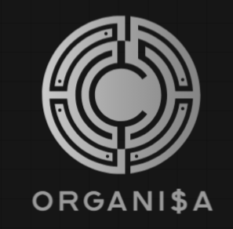

<p align="center">
  
</p>

<h1 align="center" style="color:#00FFB2;">💸 ORGANI$A 💸</h1>
<h3 align="center" style="color:#CCCCCC;">Controle Financeiro Pessoal - Protótipo Estático</h3>

<p align="center" style="color:#AAAAAA;">
  <strong>🏛️ UFMA | 💻 Desenvolvimento de Sistemas WEB | 🎯 Primeira Nota</strong>
</p>

---

## 📝 Informações do Sistema

| Item | Detalhe |
|------|---------|
| **Nome do Sistema** | ORGANI$A - Controle Financeiro Pessoal |
| **Curso** | Engenharia da Computação |
| **Universidade** | Universidade Federal do Maranhão |
| **Disciplina** | Desenvolvimento de Sistemas WEB |
| **Aluno(a)** | Renata Costa Rocha |
| **Matrícula** | 20240001556 |

---

## 💡 Sobre o Protótipo

ORGANI$A é um **protótipo estático,** com interface **moderna, responsiva e visualmente atraente,** desenvolvido para:

- 📊 Monitorar **receitas e despesas mensais**  
- 📈 Visualizar **saldos e evolução financeira** em gráficos dinâmicos  
- 🖥️ Consultar **resumo rápido do mês**  
- 🔍 Filtrar transações por **datas e categorias**  
- 🎨 Alternar entre **tema claro/escuro**  
- 🌐 Suporte a **idioma português/inglês**  

> ⚠️ Protótipo estático: ainda não implementa cálculo real de saldo, notificações ou integração com bolsas de valores.

---

## 🚀 Instruções de Navegação

1. Abra **`index.html`** em qualquer navegador moderno.  
2. Explore o menu lateral para acessar:  
   - 📊 **Dashboard**  
   - 🏦 **Minhas Contas**  
   - 💳 **Cartões**  
   - 🔄 **Lançamentos**  
   - 📈 **Relatórios**  
   - ⚙️ **Configurações**  
3. Teste filtros e barra de pesquisa no Dashboard  
4. Botões da interface estão planejados para páginas futuras  
5. Use os seletores no topo para alternar **tema e idioma**  

---

## ⚠️ Lista de Páginas Rompidas

> Todos os botões estão previstos para gerar páginas funcionais, mas ainda não possuem conteúdo completo.  
> Por enquanto, **nenhum link está quebrado**. ✅

---

## 🛠️ Observações Relevantes

- Logo centralizado no topo, seguido por:  
  **ORGANI$A**  
  **Controle Financeiro Pessoal**  
- Futuras funcionalidades:  
  - 💹 Sugestões de investimento  
  - ⚠️ Alertas de endividamento  
  - 📈 Integração com bolsas de valores  
- Tecnologias utilizadas:  
  - 🟧 **HTML5 semântico**  
  - 🟦 **CSS3 com Tailwind**  
  - 📊 **JavaScript com Chart.js**  
- Projeto será expandido para versão **mobile** e funcionalidades dinâmicas, com potencial **comercial** 💼  

---

## 🎨 Tecnologias & Badges

<p align="center">
  
  
  
  
  
</p>

---

## 📂 Estrutura de Arquivos

```
Organi$a/
│
├─ index.html          # Página principal
├─ css/
│   └─ styles.css      # Estilos personalizados
├─ js/
│   └─ main.js         # Scripts interativos e gráficos
├─ assets/
│   ├─ LOGO.png        # Logo do sistema
│   └─ fundo.avif      # Imagem de fundo
└─ README.md           # Este arquivo
```

---

## 🔗 Validações

- ✅ **HTML:** [Validador W3C](https://validator.w3.org/check?uri=referer)  
- ✅ **CSS:** [Validador W3C](https://jigsaw.w3.org/css-validator/check/referer)

---
[](https://github.com/users/ahcorataner/projects/2/views/1)
---

## 📬 Contato

- 🧑‍💻 GitHub: [@ahcorataner](https://github.com/ahcorataner)  
- 📧 E-mail: [renata.rocha@discente.ufma.br](mailto:renata.rocha@discente.ufma.br)  

---
