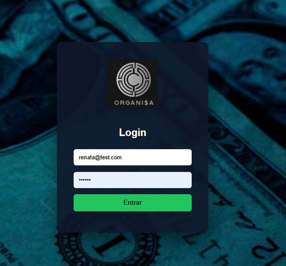
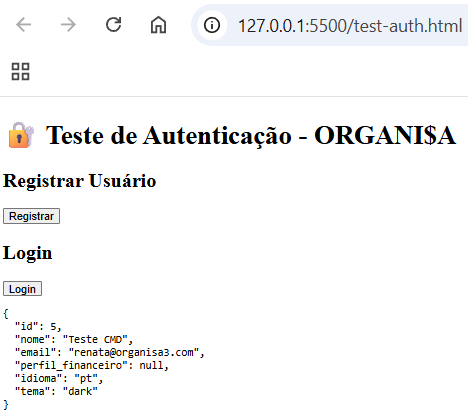
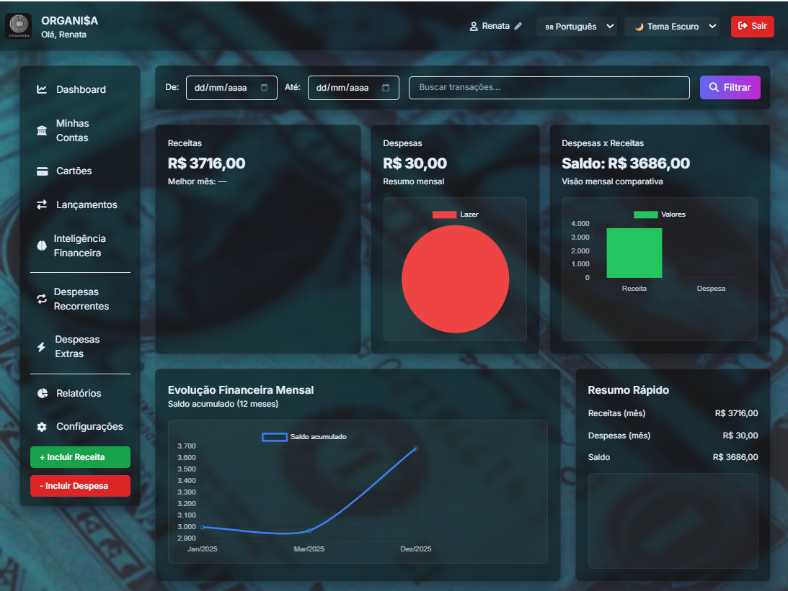
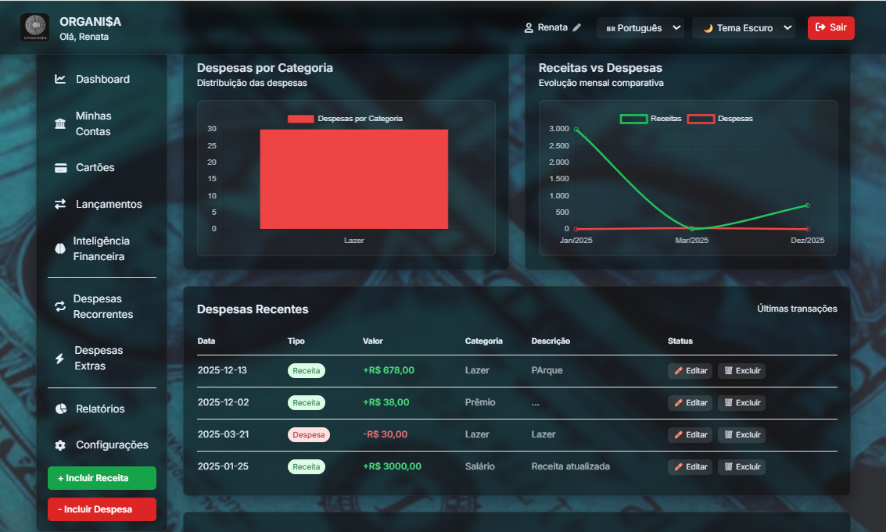
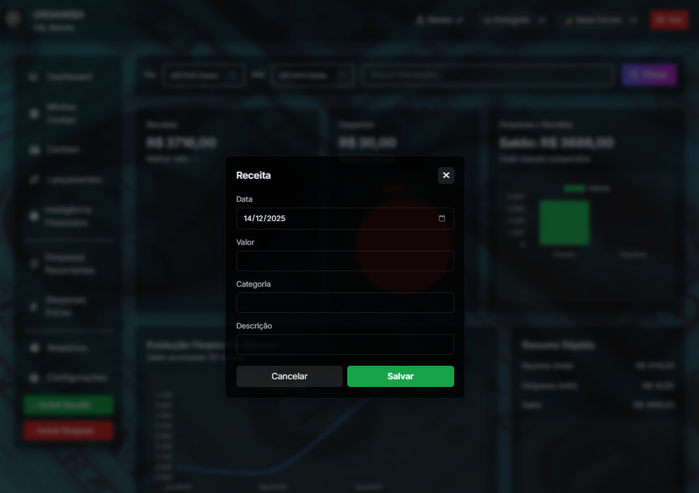
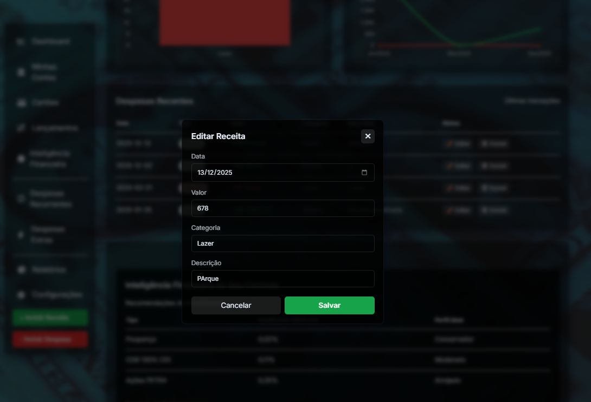
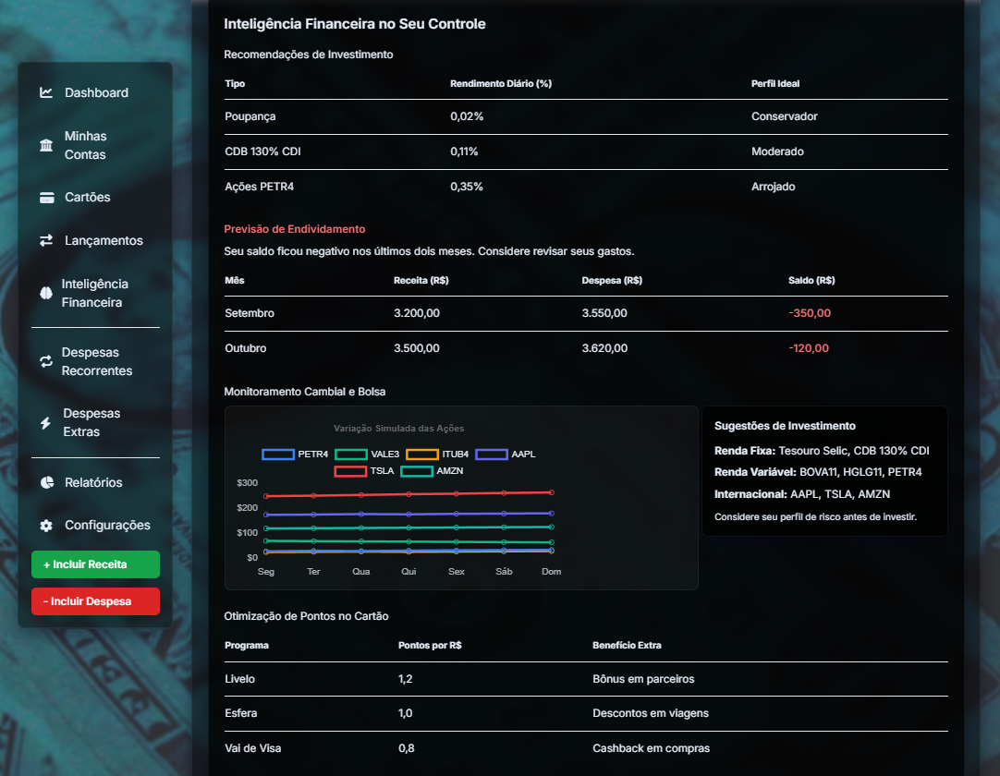
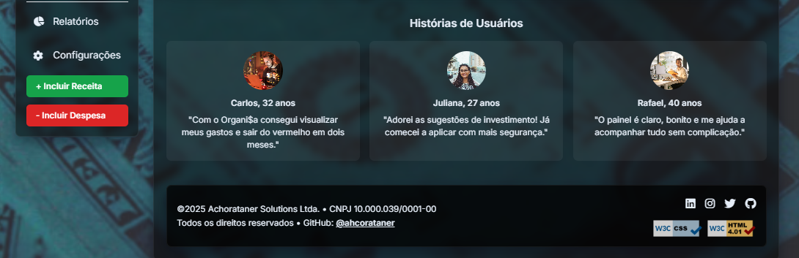

<p align="center">
  
</p>

<h1 align="center">💸 ORGANI$A 💸</h1>
<h3 align="center">Sistema Web de Controle Financeiro Pessoal</h3>

<p align="center">
  🏛️ UFMA | 💻 Desenvolvimento de Sistemas Web (DSW) | 🧩  Entrega 3 – Aplicação Web Completa
</p>

---

<h2 align="center">📝 Informações do Sistema</h2>

<table align="center">
  <tr>
    <th>Item</th>
    <th>Detalhe</th>
  </tr>
  <tr>
    <td><strong>Nome do Sistema</strong></td>
    <td>ORGANI$A – Controle Financeiro Pessoal</td>
  </tr>
  <tr>
    <td><strong>Curso</strong></td>
    <td>Engenharia da Computação</td>
  </tr>
  <tr>
    <td><strong>Universidade</strong></td>
    <td>Universidade Federal do Maranhão</td>
  </tr>
  <tr>
    <td><strong>Disciplina</strong></td>
    <td>Desenvolvimento de Sistemas WEB</td>
  </tr>
  <tr>
    <td><strong>Aluno(a)</strong></td>
    <td>Renata Costa Rocha</td>
  </tr>
  <tr>
    <td><strong>Matrícula</strong></td>
    <td>20240001556</td>
  </tr>
</table>


---

## 📌 Descrição do Projeto

O **ORGANI$A** é uma aplicação web desenvolvida para **controle financeiro pessoal**, permitindo ao usuário gerenciar **receitas, despesas, contas financeiras**, acompanhar **indicadores visuais**, gráficos interativos e receber **insights financeiros**.

A motivação do projeto surgiu a partir de uma necessidade real: a utilização recorrente de planilhas (Excel) para controle financeiro, que se mostravam pouco práticas para inserção e análise diária de dados. Assim, o ORGANI$A foi idealizado como uma solução mais intuitiva, visual e acessível. 

Na **Entrega 3**, o sistema apresenta-se como uma **aplicação web completa**, com backend funcional, autenticação segura, persistência em banco de dados, integração total frontend-backend, deploy em produção e documentação detalhada, conforme definido no PRD da Entrega 1.
---

## 🚀 Funcionalidades do Sistema

### ✅ Funcionalidades Implementadas

- Sistema completo de autenticação e autorização:
  - Registro de usuário
  - Login e logout
  - Recuperação de senha por e-mail
- Controle de sessão no frontend
- CRUD completo de:
  - Receitas
  - Despesas
  - Contas financeiras
- Dashboard financeiro interativo
- Gráficos dinâmicos:
  - Receitas x Despesas
  - Despesas por categoria
  - Evolução do saldo
- Inteligência Financeira:
  - Visualização de câmbio (USD / EUR)
  - Mercado financeiro (ações de referência – fallback estável)
  - Sugestões financeiras baseadas em cenário econômico
- Tema Dark / Light
- Internacionalização (Português / Inglês)
- Integração frontend-backend via API REST
- Persistência de dados em banco SQLite
- Tratamento robusto de erros no frontend e backend

### 🚧 Funcionalidades Não Implementadas Nesta Entrega
- Alertas automáticos de endividamento em tempo real  
  *Motivo:* funcionalidade planejada para versões futuras, exigiria regras financeiras mais avançadas e notificações assíncronas.

- Integração direta com APIs financeiras em tempo real (sem fallback)  
  *Motivo:* limitações de estabilidade e rate limit das APIs gratuitas.

- Aplicação mobile nativa  
  *Motivo:* escopo da disciplina priorizou aplicação web responsiva.

---

## 🛠 Tecnologias Utilizadas

### Frontend
- HTML5
- CSS3
- Tailwind CSS
- JavaScript ES6
- Chart.js

### Backend
- Node.js
- Express.js
- JWT (jsonwebtoken)
- bcrypt
- Nodemailer
---

## 💾 Banco de Dados

O sistema utiliza o banco de dados **SQLite** para persistência das informações.

O esquema do banco de dados está documentado no arquivo:

```
backend/banco de dados/esquema.sql

```
Esse arquivo descreve a estrutura das tabelas utilizadas pelo sistema, servindo como referência para a criação do banco de dados.

O arquivo físico do banco de dados (`.db`) é criado automaticamente durante a execução do backend e, por se tratar de um arquivo binário gerado em tempo de execução, **não é versionado no repositório.**

> SQLite: Escolhido pela simplicidade de configuração e adequação ao escopo acadêmico do projeto.

---

## 🎨 Tecnologias & Badges

<p align="center">
  
  
  
  
  
  
</p>

---

## ⚙️ Pré-requisitos

- Node.js (versão 18 ou superior)
- npm
- Navegador web moderno
- Git

---

## 🔧 Instalação

1. Clone o repositório:
```bash
git clone https://github.com/ahcorataner/organisa.git
````

2. Acesse a pasta do backend:

```bash
cd backend
```

3. Instale as dependências:

```bash
npm install
```

---

## 🔐 Configuração do Ambiente

Crie um arquivo `.env` no diretório `backend/` com base no exemplo:

```env
PORT=3000
JWT_SECRET=sua_chave_secreta
EMAIL_USER=seu_email@gmail.com
EMAIL_PASS=senha_de_app_do_gmail
ALPHA_VANTAGE_KEY=sua_api_key
```

---

## ▶️ Execução

```bash
npm start
```

* **Backend:** [http://localhost:3000](http://localhost:3000)
* **Frontend:** abrir `frontend/index.html` no navegador

---

## 🌐 Deploy da Aplicação

* **Backend (API):**
  [https://organiza-backend-ikdh.onrender.com](https://organiza-backend-ikdh.onrender.com)

* **Frontend:**
  [https://organisa-frontend.onrender.com](https://organisa-frontend.onrender.com)

---

## 📂 Estrutura do Projeto

```text
ORGANI$A/
├── backend/
│   ├── config/
│   ├── controllers/
│   ├── database/
│   │   └── schema.sql
│   ├── middleware/
│   ├── models/
│   ├── routes/
│   ├── package.json
│   └── server.js
│
├── frontend/
│   ├── assets/
│   ├── css/
│   ├── js/
│   ├── index.html
│   ├── login.html
│   └── prints/
│
├── .gitignore
└── README.md
```

---

## 🧩 Modelo de Dados (Descrição Textual)

O banco de dados é composto pelas seguintes entidades principais:

* **usuarios**

  * id, nome, email, senha, idioma, tema, reset_token, reset_expires
* **receitas**

  * id, usuario_id, valor, data, categoria, descrição
* **despesas**

  * id, usuario_id, valor, data, categoria, descrição
* **contas**

  * id, usuario_id, nome, saldo

O script completo encontra-se em:

```
backend/database/schema.sql
```

---

## 🔗 Documentação da API

### 🔐 Autenticação

* POST `/api/auth/register`
* POST `/api/auth/login`
* POST `/api/auth/forgot-password`
* POST `/api/auth/reset-password`

### 💰 Receitas

* GET `/api/receitas`
* POST `/api/receitas`
* PUT `/api/receitas/:id`
* DELETE `/api/receitas/:id`

### 💸 Despesas

* GET `/api/despesas`
* POST `/api/despesas`
* PUT `/api/despesas/:id`
* DELETE `/api/despesas/:id`

### 📈 Mercado

* GET `/api/market/exchange`
* GET `/api/market/stocks`

**Métodos HTTP:** GET, POST, PUT, DELETE
**Formato:** JSON
**Códigos:** 200, 201, 400, 401, 404, 500

---

---

## 🚀 Instruções de Navegação

1. Abra **index.html** em qualquer navegador moderno
2. Realize o **login** para acessar o sistema
3. Utilize o menu lateral para acessar:

   * 📊 Dashboard
   * 🏦 Minhas Contas
   * 💳Cartões
   * 🔄 Lançamentos
   * 📈 Relatórios
   * ⚙️ Configurações
4. Teste filtros e barra de pesquisa no Dashboard
5. Utilize os seletores no topo para alternar:

   * 🌙 Tema (dark / light)
   * 🌍 Idioma (pt / en)

---

## ⚠️ Lista de Páginas Rompidas

> Todos os botões estão previstos para gerar páginas funcionais.

✔ Nenhum link está quebrado
ℹ️ Algumas páginas ainda estão planejadas para versões futuras

---

## 🔗 Rotas / Endpoints da API

### 🔐 Autenticação
- **POST** `/api/auth/login`

### 💰 Receitas
- **GET** `/api/receitas`
- **POST** `/api/receitas`
- **PUT** `/api/receitas/:id`
- **DELETE** `/api/receitas/:id`

### 💸 Despesas
- **GET** `/api/despesas`
- **POST** `/api/despesas`
- **PUT** `/api/despesas/:id`
- **DELETE** `/api/despesas/:id`
`/api/despesas/:id`

---

## 🖼 Capturas de Tela do Sistema

As imagens a seguir apresentam as principais telas do sistema **ORGANI$A**, evidenciando o funcionamento das funcionalidades implementadas na **Entrega 2 – Desenvolvimento Parcial**.

---

### 🔐 Tela de Login
Tela responsável pela autenticação do usuário no sistema, permitindo o acesso às funcionalidades protegidas.

<p align="center">
  
</p>

---

### 🔐 Autenticação
Exemplo de autenticação bem-sucedida, demonstrando o retorno de dados do usuário após o login.

<p align="center">
  
</p>

---

### 📊 Painel Principal (Dashboard)
Dashboard financeiro com indicadores gerais, gráficos e visão consolidada das receitas e despesas.

<p align="center">
  
</p>

---

### 📈 Indicadores e Visualizações
Tela com gráficos interativos que auxiliam na análise financeira do usuário.

<p align="center">
  
</p>

---

### ➕ Inclusão de Receita
Formulário para cadastro de novas receitas, integrando frontend e backend por meio da API REST.

<p align="center">
  
</p>

---

### ✏️ Edição de Receita
Tela utilizada para atualização dos dados de uma receita previamente cadastrada.

<p align="center">
  
</p>

---

### 🌗 Tema Claro
Demonstração da interface do sistema utilizando o modo de tema claro.

<p align="center">
  
</p>

---

### 📄 Telas Adicionais
Outras telas do sistema que demonstram a navegação e organização da interface.

<p align="center">
  
</p>


<p align="center">
  
</p>


---

## 🧠 Decisões Técnicas e Justificativas

* **SQLite:** simplicidade e adequação ao escopo acadêmico
* **Node.js + Express:** leveza e rapidez no desenvolvimento
* **JWT:** controle de sessão seguro
* **Fallback financeiro:** estabilidade frente a limites de APIs externas
* **Arquitetura REST:** separação clara de responsabilidades

---

## 🧩 Diagrama de Arquitetura (Textual)

```text
Usuário
  │
  ▼
Frontend (HTML | CSS | JavaScript | Chart.js)
  │
  │ Fetch API
  ▼
Backend (Node.js | Express)
  │
  ▼
Banco de Dados (SQLite)
```

## ✅ Validação de Formulários

O sistema possui **validação de dados de entrada** tanto no **frontend** quanto no **backend,** garantindo a integridade das informações e prevenindo erros durante as operações.

### 🔹 Validação no Frontend
- Campos obrigatórios definidos nos formulários (ex.: descrição, valor e data)
- Verificação de campos vazios antes do envio
- Tipos de dados adequados (ex.: campos numéricos para valores)
- Feedback visual ao usuário em caso de dados inválidos

### 🔹 Validação no Backend
- Verificação da presença dos campos obrigatórios nas requisições
- Tratamento de requisições inválidas
- Retorno de mensagens de erro apropriadas com códigos HTTP
- Prevenção de operações inconsistentes no banco de dados

Essas validações garantem maior confiabilidade ao sistema e atendem ao requisito de **validação de formulários** exigido na Entrega 2.

---

## 🔐 Sistema de Sessão e Controle de Acesso

O sistema implementa **controle de acesso baseado em sessão,** garantindo que apenas usuários autenticados possam acessar as funcionalidades protegidas.

- Após o login bem-sucedido, as informações do usuário são armazenadas no `localStorage`
- O acesso ao dashboard é validado a cada carregamento da aplicação
- Usuários não autenticados são automaticamente redirecionados para a tela de login
- O logout remove os dados da sessão, encerrando o acesso às áreas protegidas

Esse mecanismo assegura a proteção das rotas no frontend e atende ao requisito de **controle de acesso** da Entrega 2.

---

## 🔗 Integração Frontend-Backend

A aplicação possui **integração funcional entre frontend e backend,** utilizando comunicação via **API REST.**

- O frontend realiza requisições HTTP utilizando a **Fetch API**
- O backend processa requisições nos métodos `GET`, `POST`, `PUT` e `DELETE`
- As respostas são trocadas no formato **JSON**
- O fluxo garante sincronização entre interface e persistência de dados

Essa integração permite que as ações do usuário no frontend sejam refletidas corretamente no backend.

---

## 💾 Persistência de Dados

O sistema utiliza **persistência de dados em banco de dados,** garantindo que as informações sejam mantidas mesmo após o encerramento da aplicação.

- Banco de dados utilizado: **SQLite**
- Armazenamento de receitas, despesas e informações relacionadas
- Operações de criação, leitura, atualização e exclusão refletem diretamente no banco
- A persistência assegura confiabilidade e integridade das informações

Essa abordagem atende ao requisito de **persistência de dados** definido para a Entrega 2.

---

## 🛠 Dificuldades Encontradas e Soluções

* **Conflito entre rotas do frontend e backend**
  ✔ Solução: padronização das rotas `/api/*`

* **Problemas de renderização de gráficos ao alternar tema**
  ✔ Solução: centralização da lógica de tema e gráficos

* **Código duplicado no JavaScript**
  ✔ Solução: refatoração e unificação das funções

---

## 🔗 Validações

* ✅ **HTML:** [Validador W3C](https://validator.w3.org/check?uri=referer)
* ✅ **CSS:** [Validador W3C](https://jigsaw.w3.org/css-validator/check/referer)

---

[](https://github.com/users/ahcorataner/projects/2/views/1)

---

## 📬 Contato

* 🧑‍💻 GitHub: [@ahcorataner](https://github.com/ahcorataner)
* 📧 E-mail: [renata.rocha@discente.ufma.br](mailto:renata.rocha@discente.ufma.br)

---

